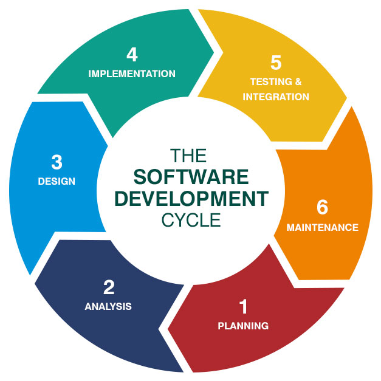
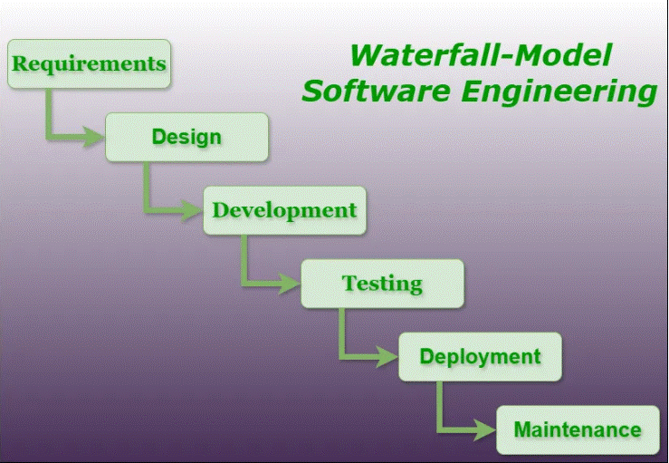
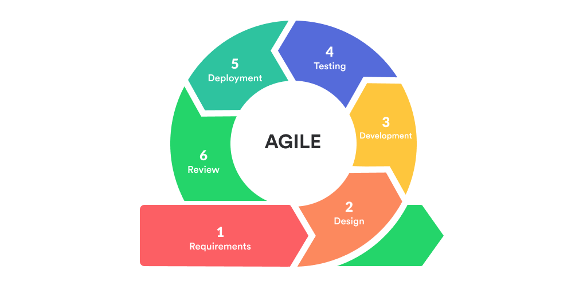
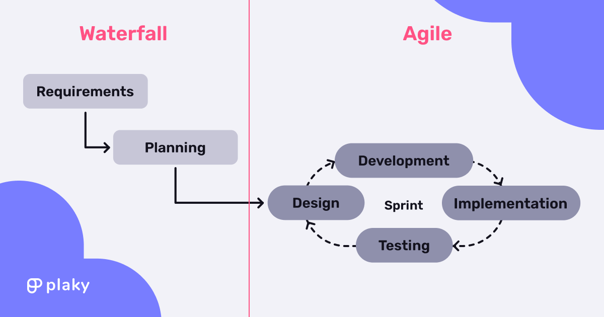
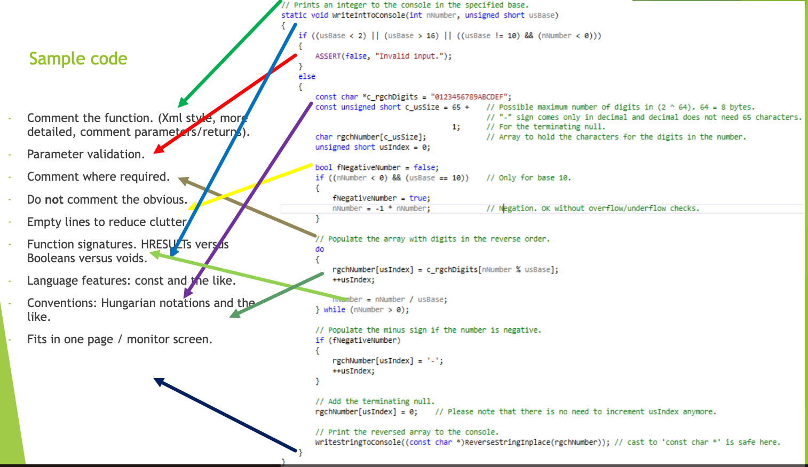
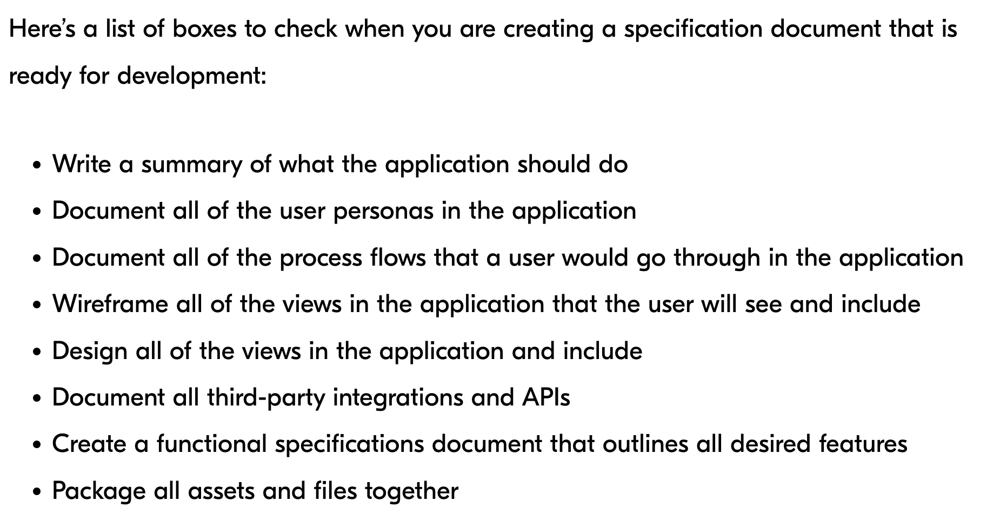

# Principles of Software Engineering

## Scope
- Software Engineering deals with how to design and develop a reasonably big software, big enough that it warrants multiple phases and multiple developers
- **Key Activities:**
    - Software development Life Cycle
    - Specify the software requirements
    - Model the software using UML diagrams
    - Architecting big software. This involves analyzing the following:
        - The various components that are required.
        - The dependencies between the components, and how they would communicate with each other.
        - Make well thought-out design choices (cost-benefit ratio, risks).
    - Design patterns
    - Predict the performance.
    - Implement
    - Validate
    - Track the progress of the project throughout the development cycle.

## Software Development Life Cycle (SDLC)

The software development lifecycle (SDLC) is the cost-effective and time-efficient process that development teams use to design and build high-quality software. The goal of SDLC is to minimize project risks through forward planning so that software meets customer expectations during production and beyond. This methodology outlines a series of steps that divide the software development process into tasks you can assign, complete, and measure.

  1. **Plan** - The planning phase typically includes tasks like cost-benefit analysis, scheduling, resource estimation, and allocation. The development team collects requirements from several stakeholders such as customers, internal and external experts, and managers to create a software requirement specification document. The document sets expectations and defines common goals that aid in project planning. The team estimates costs, creates a schedule, and has a detailed plan to achieve their goals.

  2. **Design** - In the design phase, software engineers analyze requirements and identify the best solutions to create the software. For example, they may consider integrating pre-existing modules, make technology choices, and identify development tools. They will look at how to best integrate the new software into any existing IT infrastructure the organization may have.

  3. **Implement** - In the implementation phase, the development team codes the product. They analyze the requirements to identify smaller coding tasks they can do daily to achieve the final result.

  4. **Test** - The development team combines automation and manual testing to check the software for bugs. Quality analysis includes testing the software for errors and checking if it meets customer requirements. Because many teams immediately test the code they write, the testing phase often runs parallel to the development phase.

  5. **Deploy** - When teams develop software, they code and test on a different copy of the software than the one that the users have access to. The software that customers use is called production, while other copies are said to be in the build environment, or testing environment. Having separate build and production environments ensures that customers can continue to use the software even while it is being changed or upgraded. The deployment phase includes several tasks to move the latest build copy to the production environment, such as packaging, environment configuration, and installation.

  6. **Maintain** - In the maintenance phase, among other tasks, the team fixes bugs, resolves customer issues, and manages software changes. In addition, the team monitors overall system performance, security, and user experience to identify new ways to improve the existing software.

- **Common SDLC Models:**
  - **Waterfall** 

  

  - **Agile**: 

  

  - **Hybrid Models**: 

  

## Fundamentals of Good Software
Good software has:
- **A good design document.**
- **Well-designed components**
- **Safe, clean, and structured code**
- **Fitting data structures and good algorithms**
- **Good test matrix**

## Coding Guidelines
- **Standards:** 
    - Structuring
    - Function signatures & length
    - Formatting
    - Consistency
    - Indentation
    - Readability
    - Maintainability
    - Commenting

    

## Specification Document (Spec)
- **Blueprint of Software System:**
- Typically includes 
  - requirements
  - goals
  - architecture & design (UML diagrams)
  - interfaces
  - performance/security analysis
  - validation techniques.

- [Example](https://github.com/chittur/parallel-programming-language)
