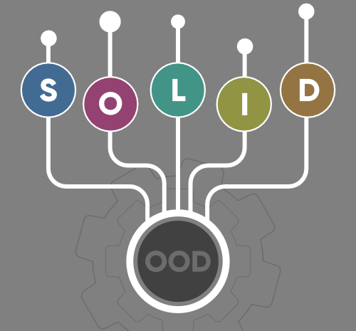
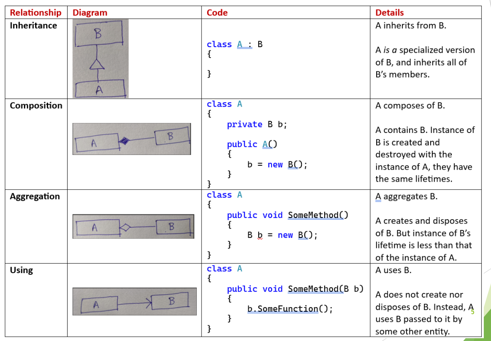

# Object Oriented Design

## **Evolution of Programming Models**
- **Goal**: Improve management of large software systems by evolving programming models.
- **Programming Models**:
  1. **Structured Programming (SP)**: 
     - Decomposes large, monolithic programs into modules using functional decomposition.
  2. **Object-Oriented Design (OOD)**: 
     - Associates data with the functions allowed to act on that data via ‘objects’.
  3. **Component Object Model (COM)**: 
     - Reduces interdependencies between objects using interfaces and object factories for isolation.
  4. **Aspect-Oriented Programming (AOP)**: 
     - Separates a program’s primary functionality from its support infrastructure to simplify logic.

## **Key Concepts in Object-Oriented Design**
- **Simulation of Real-World Objects**: 
  - Objects in software simulate real-world entities, encapsulating data and functions.

- **Four Basic Principles**:
  1. **Abstraction**: 
     - Hiding complex reality while exposing only the essential parts.
  2. **Encapsulation**: 
     - Bundling data with methods that operate on the data.
  3. **Inheritance**: 
     - Mechanism by which one class inherits properties and behavior from another class.
  4. **Polymorphism**: 
     - Ability of different classes to respond to the same function call in different ways.

## **SOLID Principles of Object-Oriented Design**

The SOLID principle helps in reducing tight coupling. Tight coupling means a group of classes are highly dependent on one another which you should avoid in your code.
- Opposite of tight coupling is loose coupling and your code is considered as a good code when it has loosely-coupled classes.
- Loosely coupled classes minimize changes in your code, helps in making code more reusable, maintainable, flexible and stable. Now let’s discuss one by one these principle

1. **Single-Responsibility Principle**: A class should have only one reason to change, meaning it should have only one job or responsibility.

> **Example** Imagine a baker who is responsible for baking bread. The baker’s role is to focus on the task of baking bread, ensuring that the bread is of high quality, properly baked, and meets the bakery’s standards.
> - However, if the baker is also responsible for managing the inventory, ordering supplies, serving customers, and cleaning the bakery, this would violate the SRP.
> - Each of these tasks represents a separate responsibility, and by combining them, the baker’s focus and effectiveness in baking bread could be compromised.
> - To adhere to the SRP, the bakery could assign different roles to different individuals or teams. For example, there could be a separate person or team responsible for managing the inventory, another for ordering supplies, another for serving customers, and another for cleaning the bakery.
   
2. **Open-Closed Principle**: Classes should be open for extension but closed for modification. New functionality should be added by extending existing classes, not modifying them.

> **Exapmple** Imagine you have a class called PaymentProcessor that processes payments for an online store. Initially, the PaymentProcessor class only supports processing payments using credit cards. However, you want to extend its functionality to also support processing payments using PayPal.
> Instead of modifying the existing PaymentProcessor class to add PayPal support, you can create a new class called PayPalPaymentProcessor that extends the PaymentProcessor class. This way, the PaymentProcessor class remains closed for modification but open for extension, adhering to the Open-Closed Principle
   
3. **Liskov Substitution Principle**: Objects of a derived class should be able to replace objects of the base class without altering the correctness of the program.

> **Example** One of the classic examples of this principle is a rectangle having four sides. A rectangle’s height can be any value and width can be any value. A square is a rectangle with equal width and height. So we can say that we can extend the properties of the rectangle class into square class. 
> - In order to do that you need to swap the child (square) class with parent (rectangle) class to fit the definition of a square having four equal sides but a derived class does not affect the behavior of the parent class so if you will do that it will violate the Liskov Substitution Principle.
   
4. **Interface Segregation Principle**: No client should be forced to depend on interfaces it does not use.
> Suppose if you enter a restaurant and you are pure vegetarian. The waiter in that restaurant gave you the menu card which includes vegetarian items, non-vegetarian items, drinks, and sweets.
> - In this case, as a customer, you should have a menu card which includes only vegetarian items, not everything which you don’t eat in your food. Here the menu should be different for different types of customers.
> - The common or general menu card for everyone can be divided into multiple cards instead of just one. Using this principle helps in reducing the side effects and frequency of required changes.
   
5. **Dependency Inversion Principle**: High-level modules should not depend on low-level modules. Both should depend on abstractions. Abstractions should not depend on details, but details should depend on abstractions.

> In a software development team, developers depend on an abstract version control system (e.g., Git) to manage and track changes to the codebase. They don’t depend on specific details of how Git works internally. This allows developers to focus on writing code without needing to understand the intricacies of version control implementation. 

## **Class Relationships**

## **Software Contracts**
- **Interfaces and Contracts**:
  - Define how different components in software interact with each other.
  - Examples include interfaces for user interactions, networking, etc.
  - Contracts are specified through interfaces, allowing components to be developed independently and concurrently.
  
- **Why Contracts Are Needed**:
  - Contracts ensure that components can be developed in isolation and can still work together when integrated.

- **Example**: 
  - A user interface sends a message via a communication interface to a networking component, which then transmits the message. The UI is agnostic to the underlying implementation, whether it’s via sockets, pipes, HTTP, etc.