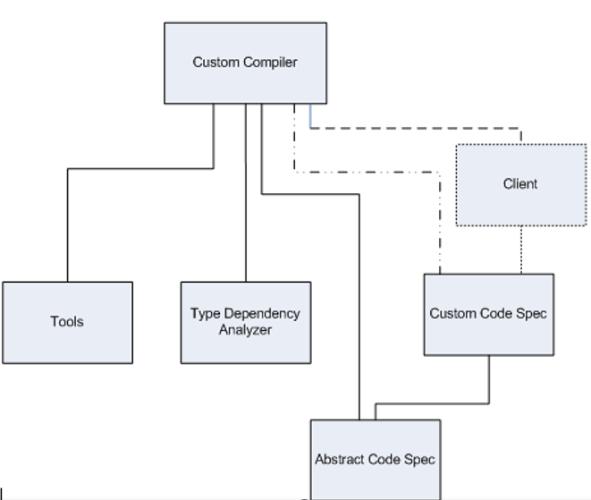
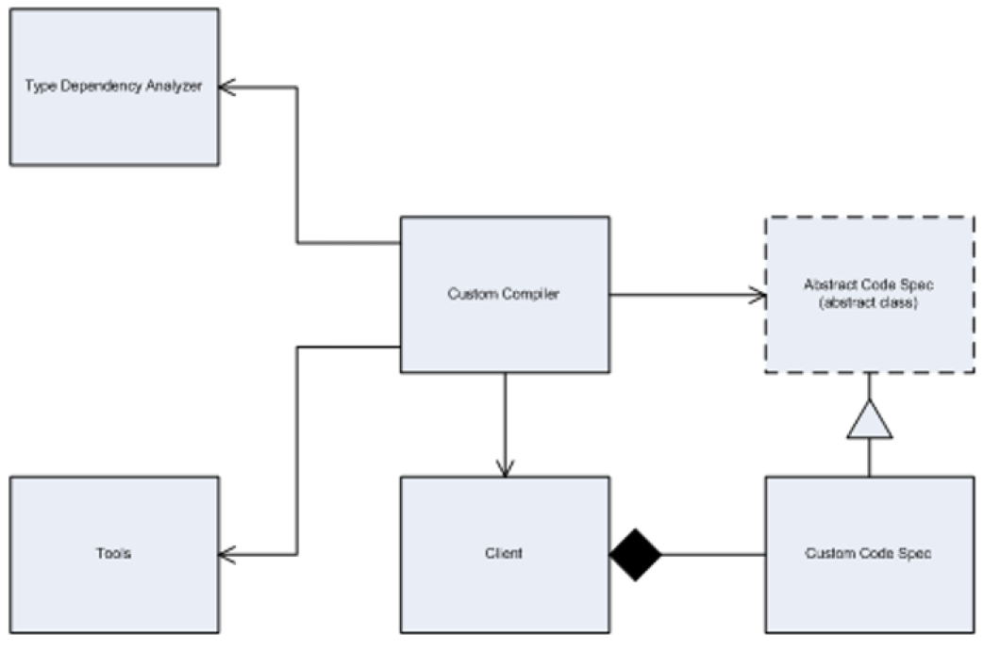
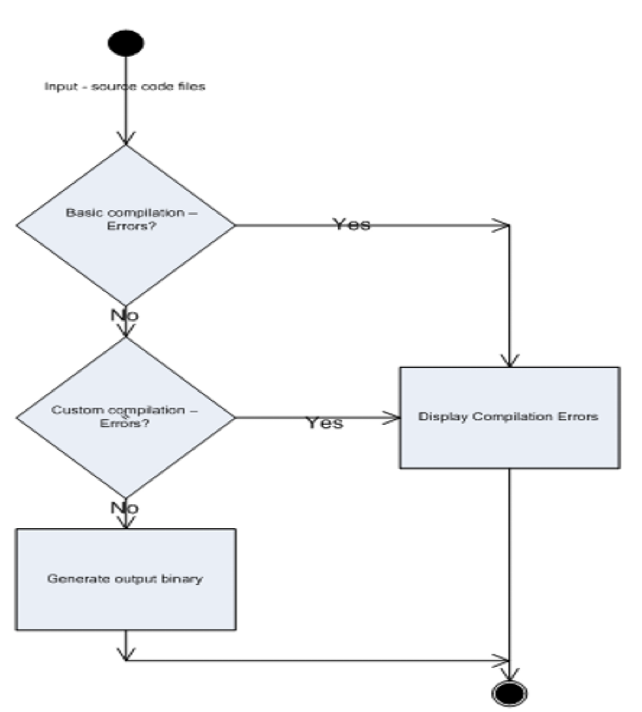

# Unified Modelling Language

Unified Modeling Language (UML) is a general-purpose modeling language. The main aim of UML is to define a standard way to visualize the way a system has been designed. It is quite similar to blueprints used in other fields of engineering. UML is not a programming language , it is rather a visual language.

Common types of UML diagrams
- Module diagram
- Class diagram
- Activity diagram

## Module diagram
Shows the various modules in the software project, and their dependencies.
- No cyclic dependency.
- Lower level modules may not depend on upper level modules.

## Class diagram
Shows the relationship between the various types in the software project: Composition, Aggregation, Inheritance and Using.

## Activity diagram 
This is essentially a version of a flow chart that shows the sequence of activities between the various components in the software project.

