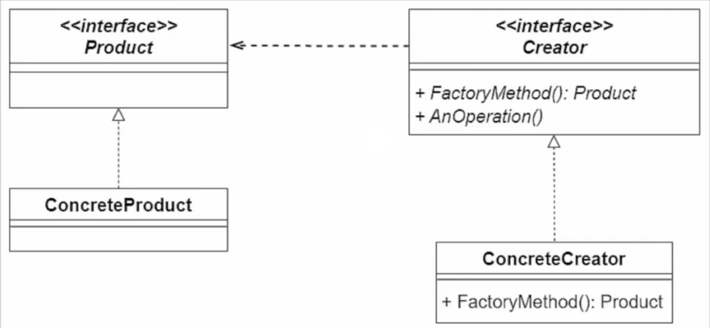
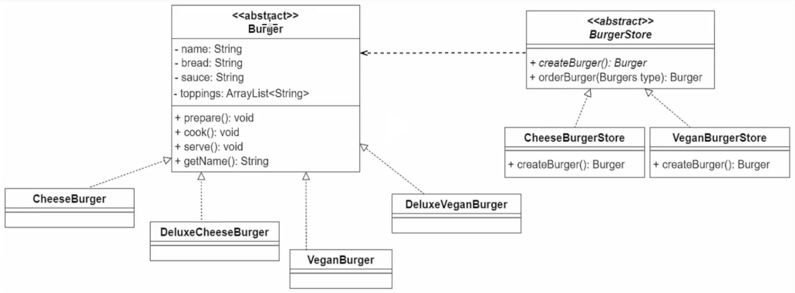

# Design Patterns

Design patterns are solutions to software design problems you find again and again in real-world application development. Patterns are about reusable designs and interactions of objects.

## Creational Patterns
### Factory Pattern

## Structural Patterns
## Behavioral Patterns

[ref](https://www.dofactory.com/net/design-patterns#list)